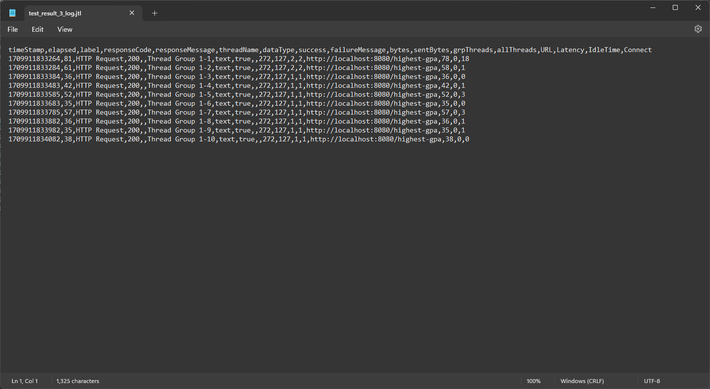

# 1. all-students

# 2. all-student-name

# 3. highest-gpa

## After Optimization

# REFLECTION
1. JMeter is a load testing tool used to analyze and measure the performance of web application or variety of services. It simulates a heavy load on a server to test its strength or to analyze overall performance under different load types. On the other hand, IntelliJ Profiler is a tool used for profiling applications. It helps with identifying bottlenecks, high-latency operations, and resource-intensive blocks in the code.

2. Profiling helps with identifying part of the code that is taking the most time to execute. So only that part of the code must be optimized. Profiling also helps with identifying memory leaks, memory consumption, the most frequently called methods, and the most frequently accessed objects.

3. Yes, it does effectively assisting me in analyzing and identifying the bottlenecks in the code because it provides a detailed report of the code execution. It also provides a visual representation of the code execution which makes it easier to understand and analyze.

4. The main challenge i faced was to understand the profiling tool and how to use it effectively. I overcame this challenge by reading the documentation and watching tutorials on how to use the profiling tool effectively.

5. From using Intellij Profiler for profiling my code, i can identify the most frequently called methods, the most frequently accessed objects, and the memory consumption of the code. This information is very useful because it helps with identifying the bottlenecks in the code and also helps with optimizing the code.

6. If the results from IntelliJ Profiler are not consistent with JMeter, it could be due to differences in the testing environment, the load applied, or the specific aspects of the application that each tool is analyzing. In such cases, it's important to understand the capabilities and limitations of each tool, and to consider the results in the context of the overall performance of the application.

7. After profiling using Intellij Profiler, i can identify the methods that are taking the most time to execute. I can then only focus on optimizing those methods to improve the performance.